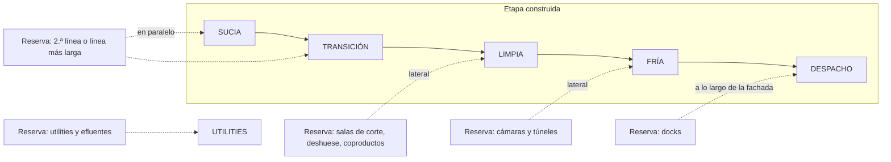

# Estrategia de expansión modular del layout

**Fecha:** 2026-10-01 · **Versión:** 1.0 (sesión 12C) · Fase 0

> **Alcance:** cómo puede **crecer físicamente** la planta en las trayectorias 2.500 → 5.000 → 10.000 → 20.000, 5.000 → 10.000 → 20.000 y 10.000 → 20.000; qué conviene sobredimensionar, preparar, modular o duplicar, y qué sería muy caro mover después. **No** elige arquitectura de crecimiento (DEC-033), escala, número de líneas (DEC-038) ni CAPEX. Aplica el principio ya aprobado en [`../23_plan_expansion/arquitectura_escalable.md` §1](../23_plan_expansion/arquitectura_escalable.md) (SUP-059, DEC-035): **anticipar la infraestructura barata de prever y cara de modificar; modular los equipos caros que podrían quedar ociosos.** Qué pasa adentro de la línea en cada salto: [`../05_proceso_industrial/arquitecturas_por_escala.md` §8](../05_proceso_industrial/arquitecturas_por_escala.md) (no se repite).

---

## 1. Lo que muestra el modelo si se reserva desde el inicio la superficie de la escala final

Con escala objetivo 20.000 aves/día, el modelo reserva en cada etapa la diferencia entre lo que necesita la escala final y lo que ya está construido (por categoría), más la reserva de rendering. Resultado (medio; [`escenarios_superficies.csv`](escenarios_superficies.csv), bloque `expansion`; test T18):

| Trayectoria · etapa | m² construidos | Reserva de expansión | Terreno necesario |
|---|---|---|---|
| A · 2.500 | 1.780 | 10.800 | **3,3 ha** |
| A · 5.000 | 2.600 | 9.410 | 3,3 ha |
| A · 10.000 | 4.310 | 6.340 | 3,3 ha |
| A · 20.000 | 7.450 | 640 (rendering) | 3,3 ha |
| B · 5.000 → 10.000 → 20.000 | 2.600 → 4.310 → 7.450 | 9.410 → 6.340 → 640 | 3,3 ha en todas |
| C · 10.000 → 20.000 | 4.310 → 7.450 | 6.340 → 640 | 3,3 ha en ambas |

Rango del terreno con objetivo 20.000: **~1,4 / 3,3 / 8,2 ha** (bajo / medio / alto), con tratamiento compacto; con lagunas, bastante más (§ [`layouts_por_escala.md` §4](layouts_por_escala.md)).

**Lecturas:**

1. **Convergencia condicionada al supuesto de reserva total.** Dentro del modelo actual, **si se supone que desde el inicio se adquiere y reserva toda la superficie necesaria para la escala final de 20.000 aves/día**, las distintas trayectorias convergen al mismo requerimiento conceptual de terreno. Lo que cambia entre ellas, bajo ese supuesto, es **cuánto se construye y cuándo**. El test T18 verifica esa propiedad aritmética del modelo, no una conclusión de inversión.
2. **Lo que esto NO implica:**
   - que todas las estrategias de inversión requieran comprar el mismo terreno desde el día 1 (una estrategia puede comprar menos y asumir el riesgo de techo, o comprar con opción sobre lotes vecinos);
   - que no pueda adquirirse superficie adicional más adelante (puede ser posible o no según el sitio; es un dato a relevar, no un imposible);
   - que no puedan tercerizarse funciones (congelado, almacenamiento, rendering, tratamiento de efluentes por vuelco a colectora, lavado de camiones) que reducirían el terreno propio;
   - que el terreno no cambie con la tecnología de efluentes, el congelado propio o tercerizado, la reserva de rendering, el diseño de accesos o la normativa del sitio (retiros, FOS, distancias): todos lo mueven y ninguno está decidido.
3. **Bajo el supuesto de reserva total, arrancar chico no ahorra terreno; ahorra obra.** En la trayectoria A, en la etapa 1 el ~72 % de los m² operativos que la planta final necesitará (sin contar retiros, buffers ni rendering) está todavía como reserva: 3.640 m² de proceso, 4.120 m² de exteriores, 1.090 de servicios, 490 de personal, 460 de frío, 370 de efluentes y 640 de rendering.
4. **Sin escala objetivo, la reserva es una fracción arbitraria** (25–100 % de lo operativo, SUP-119, alerta `OBJETIVO_EXPANSION_NO_DEFINIDO`). Definir **para qué escala final se reserva el terreno** es una decisión nueva (DEC-063) que debe tomarse **antes** de comprar terreno (ruta crítica R1 de [`../16_normativa_senasa/ruta_critica_habilitacion.md`](../16_normativa_senasa/ruta_critica_habilitacion.md)), aunque la escala inicial siga abierta.

## 2. Qué hacer con cada elemento físico

Clasificación (hipótesis de trabajo, SUP-123; complementa la de 23 y 09A):

- **S — Sobredimensionar desde el inicio** (barato de prever, carísimo o imposible de corregir).
- **P — Dejar preparado** (espacio, vanos, troncales con derivaciones ciegas, fundaciones), sin instalar.
- **M — Modular** (construir o comprar por etapa).
- **D — Duplicar** (agregar unidades iguales en paralelo).

| Elemento | Clase | Por qué | Qué significa en el layout |
|---|---|---|---|
| **Terreno** (incluye retiros, buffers, efluentes, rendering) | **S** | Comprar el lote vecino después suele ser imposible; mudarse es perder todo | Asegurar el terreno de la escala objetivo (§1) |
| **Accesos, portones y traza de circulación pesada** (3 circuitos) | **S** en traza, **M** en pavimento | La separación vivo / producto / subproductos no se arregla después (F5) | Portones en lados distintos; caminos con ancho final, pavimento por etapas |
| **Orden de zonas y dirección del flujo** | **S** | Invertir el flujo para ampliar compromete la habilitación | Secuencia fija sucia → limpia → fría → despacho, con **frentes de ampliación laterales** (§3) |
| **Pendientes de piso, desagües y colector industrial** | **S** en troncales, **P** en ramales | Romper pisos de salas limpias para recolocar desagües detiene la planta | Colector troncal dimensionado para la escala final; ramales con tapa en zonas de reserva |
| **Troncales de servicios** (frío, agua, vapor, aire, electricidad) en galería o pared técnica | **S** en traza y diámetro principal, **P** en derivaciones | Las cañerías dentro de salas limpias son difíciles de intervenir | Galería técnica perimetral con espacio para tubos futuros |
| **Potencia eléctrica, subestación y lugar del transformador** | **P** (reservar potencia y lugar) | La factibilidad de potencia tarda y puede ser el techo (DPV-052) | Playón de subestación con espacio para un segundo transformador |
| **Permiso de vuelco y punto de vuelco** | **S** | Es un permiso, no una obra: ampliarlo puede no ser posible | Pedir el permiso para la escala objetivo si la autoridad lo admite (DPV-106) |
| **Tratamiento de efluentes** | **P** en terreno, **M/D** en unidades | Los módulos se agregan; el terreno no | Reservar la superficie de la tecnología **más extensa compatible con el sitio** hasta decidir DEC-043 |
| **Nave de faena** (largo y altura para el ritmo final, o ancho para la 2.ª línea) | **P** | Alargar una nave detrás de la recepción o al lado del chiller suele ser imposible | Fundación y espacio para el largo final **o** franja paralela para la 2.ª línea (§4) |
| **Línea de faena y evisceración** | **M** (o reemplazo planificado) | Equipo caro que puede quedar ocioso | Comprar para la etapa con ampliación especificada en el RFQ (09A §8) |
| **Enfriamiento** | **P** (espacio para tanque/recorrido adicional) | Es el equipo más largo y está en la frontera F2 | Espacio contiguo a la salida del chiller **del lado de la zona limpia** |
| **Salas de corte, deshuese, coproductos** | **P** en espacio refrigerado contiguo, **M** en equipos | Lo difícil de agregar es el espacio frío junto al chiller, no las mesas (09A §7) | Muro de ampliación "blando" (panel) hacia la reserva |
| **Cámaras** | **M/D** | Modulares y caras de tener vacías | Fachada de cámaras con lugar para agregar módulos **sin cruzar el despacho** |
| **Túneles de congelado** | **M/D** | Dependen del perfil P1–P3, que no está validado | Espacio reservado contiguo a empaque y cámaras de congelado |
| **Sala de máquinas de frío** | **P** (espacio para compresores adicionales) + **D** en compresores | Rehacer la sala y las troncales es caro (23 §1) | Sala con espacio para N+1 compresores de la escala final |
| **Docks de expedición** | **P** en fachada, **M** en docks | El frente de docks depende del canal (DPV-036) | Fachada de despacho con largo para los docks finales |
| **Andén de recepción** | **M** con espacio **P** | Crece en escalones de bahías | Lugar para 1–2 bahías adicionales |
| **Vestuarios y comedor** | **M** con espacio **P** | Los vestuarios son parte del flujo higiénico; el 2.º turno los comparte en horario | Bloque de personal ampliable sin mover los filtros sanitarios |
| **Oficinas y oficina SENASA** | **M** | Bajo costo relativo | — |
| **Calderas, compresores de aire, generador** | **D** | Se agregan unidades | Espacio en la sala para la unidad siguiente |
| **Rendering** | **P** (solo terreno) | No decidido (DEC-027); sin espacio la opción desaparece | Reserva contigua a subproductos, lejos de la limpia y de vecinos (DEC-066) |

## 3. Dirección del crecimiento (principio de diseño preliminar)

> **Principio de diseño preliminar (SUP-123), no regla arquitectónica universal:** *preferir expansiones que prolonguen o dupliquen secuencias funcionales sin introducir cruces ni romper la zonificación higiénica.* Un proyectista puede encontrar otras soluciones válidas (por ejemplo, una ampliación intercalada ejecutada en una parada programada con aprobación previa); el principio indica qué conviene preferir cuando el layout todavía es flexible.

1. **Prolongar o duplicar secuencias:** líneas en paralelo, salas limpias contiguas a la zona limpia, cámaras contiguas a la zona fría, docks a lo largo de la fachada de despacho.
2. **Evitar, en lo posible, ampliaciones que corten la secuencia** existente (p. ej., una sala nueva entre evisceración y chiller): suelen exigir parar la planta, romper barreras sanitarias y volver a presentar planos (DPV-115).
3. **Muros de ampliación livianos** (paneles) del lado de la reserva; **muros fijos** del lado de las fronteras higiénicas.
4. **No poner nada caro de mover del lado de la reserva:** sala de máquinas, subestación, tanques, tratamiento de efluentes y vestuarios van en los lados que **no** van a crecer.
5. **Obra durante la operación:** cada frente de ampliación necesita un **acceso de obra** que no cruce flujos de producto ni de vivo (§ [`flujos_layout.md` §7](flujos_layout.md)).

## 4. Las tres trayectorias, físicamente

| Paso | Qué se construye | Qué ya debía estar previsto | Riesgo si no se previó |
|---|---|---|---|
| **2.500 → 5.000** (A) | Más andén, salas de corte más grandes, túnel estático, cámaras; línea ampliada (si es modular) | Largo de nave y espacio contiguo al chiller; troncales; terreno | Reemplazo total de la línea y obra que corta la operación |
| **5.000 → 10.000** (A, B) | Evisceración automática (reemplazo), salas dedicadas, congelado continuo, 2.º dock, efluentes ampliados | Ancho para salas dedicadas; sala de máquinas ampliable; módulos de tratamiento | Salas limpias encerradas; efluente que limita la producción |
| **10.000 → 20.000** (A, B, C) | 2.ª línea **o** 2.º turno (09A: ecuación de 24 h en alerta) **o** línea de mayor ritmo; 3.er dock; más cámaras; posiblemente rendering | Franja paralela o largo final; potencia; permiso de vuelco | Techo físico definitivo: la única salida es otra planta |

**Arquitectura E** de 23 ("obra grande, equipos por etapas") es el extremo en que se construye hoy la **envolvente** final; el modelo muestra que construir 7.450 m² para operar 1.780 (A en etapa 1) inmoviliza ~4 veces la obra necesaria. **Arquitectura D** (validación comercial previa) puede postergar la compra de terreno hasta tener demanda A/B (DEC-018) y, con faena o congelado tercerizados, cambiar también cuánto terreno propio hace falta.

## 5. Puntos difíciles de modificar después (lista de control)

1. Tamaño y forma del terreno; servidumbres; accesos desde la ruta.
2. Ubicación de los tres portones y la traza de circulación pesada.
3. Dirección del flujo sucia → limpia y posición de la frontera F1 (transferencia) y F2 (chiller).
4. Niveles de piso, pendientes, colector industrial y separación de pluviales.
5. Losa y fundaciones de equipos pesados (chiller, túneles, compresores); fosos y canales de subproductos bajo piso.
6. Altura libre de naves (riel aéreo, túnel de aire, racks de cámaras).
7. Ubicación de la sala de máquinas de frío, la subestación y la caldera (y sus troncales).
8. Ubicación del tratamiento de efluentes, punto y permiso de vuelco.
9. Vestuarios y filtros sanitarios (definen los accesos de personal a cada zona).
10. Fachada de docks y fachada de recepción.
11. Posición de la oficina y los puestos del servicio oficial.
12. Distancias a vecinos y retiros (definen dónde **no** se puede crecer).

**Por qué una máquina nueva puede obligar a "romper media planta":** si no hay vano de montaje, no entra; si no hay losa preparada, no se apoya; si no hay troncal, no tiene agua, aire, vapor ni frío; si no hay desagüe en su lugar, no se puede lavar; y si su lugar está en medio del flujo, para instalarla hay que **cortar la producción y romper la barrera sanitaria** — lo que puede exigir una nueva aprobación de planos (DPV-115). Ver [`guia_ramiro.md` §7](guia_ramiro.md).

## 6. Relación con gates y decisiones

- La variable **V17 "servicios y terreno"** de [`../23_plan_expansion/gates_expansion.md`](../23_plan_expansion/gates_expansion.md) puede medirse con este modelo: m² de terreno y de reserva disponibles vs necesarios para la etapa siguiente.
- Decisiones abiertas: escala objetivo del terreno (DEC-063), forma de la nave (DEC-062), reserva de rendering (DEC-066). Notas de 12C a DEC-035, DEC-038 y DEC-043 integradas en [`../00_gestion_proyecto/decisiones_pendientes.md`](../00_gestion_proyecto/decisiones_pendientes.md) (reconciliación de las sesiones 12 (2026-10-01)).
- **Planificar la expansión no es construirla:** se asegura el terreno que la estrategia elegida considere necesario (total, parcial o con opciones) y se trazan accesos, troncales y frentes; los equipos, cámaras, salas y docks se agregan cuando un gate lo justifique.
