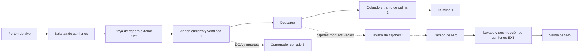
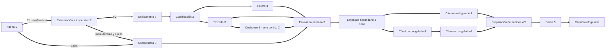
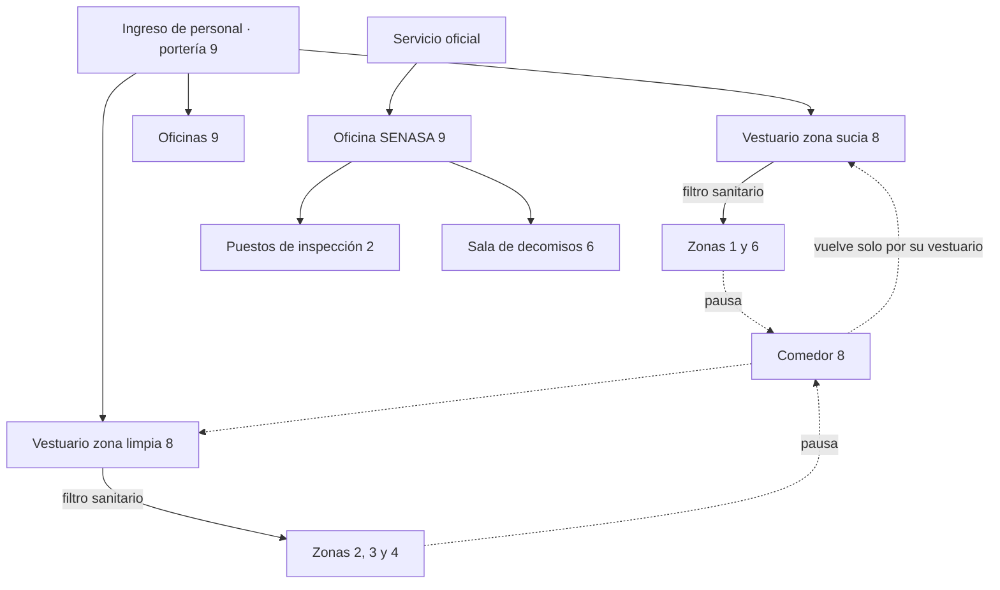
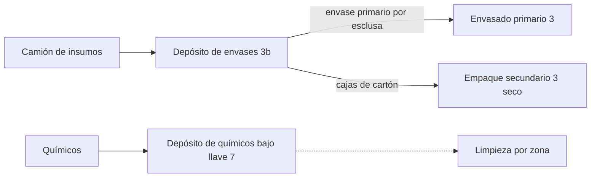
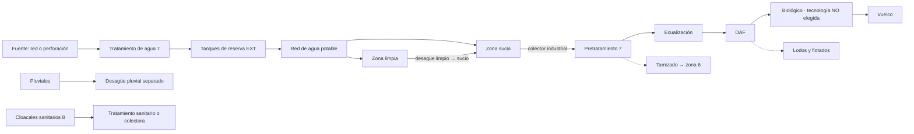

# Flujos del layout conceptual

**Fecha:** 2026-10-01 · **Versión:** 1.0 (sesión 12C) · Fase 0

> **Alcance:** nueve flujos representados **por separado** (aves vivas, producto, personal, subproductos, residuos, envases, equipos/mantenimiento, camiones, agua/efluentes), con sus puntos de conflicto y la regla conceptual que los evita. **Objetivo:** que ningún flujo sucio cruce uno limpio. **No** es un plano ni una ubicación de puertas. Base de etapas: [`../05_proceso_industrial/flujo_proceso.md`](../05_proceso_industrial/flujo_proceso.md) (E01–E32, X1–X7). Zonas: [`zonificacion_layout.md`](zonificacion_layout.md). Volúmenes por hora y día: 09A (`capacidad_proceso.csv`) y [`escenarios_superficies.csv`](escenarios_superficies.csv).
> La logística externa (rutas, flota, frecuencias, centros de distribución) es del módulo 12B (`13_logistica`); aquí solo importa **por dónde entra y sale cada camión dentro del predio**.

Leyenda de zonas: **1** sucia · **2** transición · **3** limpia (3b apoyo seco) · **4** fría · **5** despacho · **6** subproductos · **7** utilities · **8** personal · **9** administrativa · **EXT** terreno.

---

## 1. Aves vivas

| Punto | Conflicto a evitar | Regla conceptual |
|---|---|---|
| Espera | Camiones al sol, sin ventilación (DOA, bienestar) | Andén **cubierto y ventilado** dimensionado por **bahías** (horas de espera × ritmo ÷ aves por camión, SUP-108); en verano puede limitar la llegada |
| Playa de vivo | Compartir playa con despacho | Acceso y playa **exclusivos** (F5) |
| Cajones/módulos | Cajones lavados que vuelven por zona de producto | Lavadero en zona 1 y retorno directo al camión |
| Volumen | 2.500 → 20.000 aves/día = ~1 → 7 camiones/día con 3.000–6.000 aves por camión (**proxy**, DPV-084) | Las bahías crecen en escalón, no linealmente |

## 2. Producto

| Punto | Conflicto a evitar | Regla conceptual |
|---|---|---|
| Reproceso | Carcasa que vuelve a una zona anterior | Estación de reproceso dentro de la misma zona |
| Patas/garras y menudencias | Tratarlas como subproductos | Son **comestibles**: van por el circuito de producto a su sala (zona 3) |
| Salida del frío | Producto que cruza la playa de vivo o subproductos para llegar al camión | Docks en fachada propia (zona 5) |
| Exportación | Mezcla de lotes por destino | Espacio de cámara para segregar lotes (DPV-145) |
| Producto cocido futuro | Crudo y cocido en la misma sala | Reserva de sala separada con personal propio (09A §3) — no se dimensiona |

## 3. Personal

| Punto | Conflicto a evitar | Regla conceptual |
|---|---|---|
| Comedor | Que sea un atajo entre zona sucia y limpia | Comedor con retorno **obligado** por el vestuario de cada zona |
| Personal polivalente (2.500 aves/día) | Mismo operario en zona sucia y limpia en el día | Procedimiento de cambio + vestuario intermedio; el layout no lo resuelve solo (09A §4) |
| Mantenimiento | Pasar con herramientas de sucia a limpia | Pañoles por zona (§7) |
| Visitas y clientes | Recorrer salas | Circuito de visitas con visores o galería (opcional; no dimensionado) |

## 4. Subproductos (no comestibles)

| Origen (zona) | Material | Medio de transporte conceptual | Destino (zona 6) | Salida |
|---|---|---|---|---|
| Sangrado (1) | Sangre | Canal → bomba → tanque cerrado (sin diluir) | Sala de sangre | Camión cisterna de retiro |
| Desplumado (1) | Plumas | Canal de agua o tornillo → escurridor | Tolva/contenedor | Camión de retiro |
| Corte de cabeza (1/2) | Cabezas | Canal o tornillo | Contenedor | Idem |
| Evisceración (2) | Vísceras no comestibles, contenido GI | Canal o **vacío** → tamiz | Contenedor cerrado | Idem |
| Inspección (2) | Decomisos | Recipiente identificado y precintado | **Sala de decomisos** (separada) | Destino según norma (DPV-066) |
| Deshuese/CMS (3, config. C) | Hueso, residuo de CMS, piel sin comprador | Contenedores desde la sala | Cámara de subproductos | Rendering |

**Regla:** los subproductos **salen lateralmente** de la línea hacia la zona 6 por canales, bombas o tornillos; **ningún contenedor atraviesa salas de producto ni comparte puertas con él**. La zona 6 tiene **playa y portón propios**. El volumen pasa de ~1,5 a ~12 t/día de sólidos (config. B; hasta ~19 t/día con deshuese), por lo que a 10.000–20.000 aves/día el retiro es un flujo industrial continuo. La **reserva de rendering** (si se decide reservarla, DEC-066) debe ser contigua a la zona 6 y alejada de la zona limpia y de los vecinos.

## 5. Residuos (no subproductos)

| Residuo | Origen | Circuito | Regla |
|---|---|---|---|
| Cartón y film de desembalaje | Depósito de envases (3b), empaque secundario | Compactadora en zona 6 | No vuelve a salas de proceso |
| Residuos de comedor y oficinas | 8, 9 | Contenedores urbanos | Circuito separado del industrial |
| Tamizado del efluente | Pretratamiento (7) | Contenedor → rendering o disposición | Sale por la playa de subproductos |
| Lodos y flotados | Tratamiento de efluentes (7) | Espesado/deshidratación → acopio | Lodos **PENDIENTES** (09C, DPV-114); su área es proxy |
| Residuos peligrosos (aceites, químicos vencidos, luminarias) | Mantenimiento, químicos | Depósito transitorio cerrado | Normativa por jurisdicción (DPV-106) |

## 6. Envases y materiales

**Reglas:** el cartón y los pallets son "sucios por definición" y no entran a salas de proceso (09A §1); el envase primario entra por **esclusa o pasaplatos**; los químicos se guardan separados de envases e insumos alimentarios ([`../16_normativa_senasa/requisitos_sanitarios.md` §2](../16_normativa_senasa/requisitos_sanitarios.md), `[PVDP]`). El camión de insumos puede compartir el acceso de **despacho** si las ventanas horarias no se superponen (dato de 12B), nunca el de vivo.

## 7. Equipos y mantenimiento

| Flujo | Conflicto | Regla conceptual |
|---|---|---|
| Repuestos y herramientas | Herramientas de zona sucia en zona limpia | Pañol central + **cajas de herramientas por zona** (o sanitización documentada) |
| Ingreso de equipos grandes (ampliación, reemplazo) | Tener que demoler muros de salas limpias para entrar una máquina | **Portones o paneles desmontables** en fachadas de ampliación; vanos de montaje previstos en la obra gruesa (§ [`estrategia_expansion.md`](estrategia_expansion.md)) |
| Mantenimiento de troncales | Entrar a salas limpias para intervenir cañerías | Galería o pared técnica exterior a las salas (zona 7) |
| Limpieza | Mangueras y útiles de sucia en limpia | Puntos de agua y espuma por zona; se limpia de limpio a sucio (09A §5) |

## 8. Camiones (dentro del predio)

| Tipo | Acceso | Playa | Frecuencia conceptual | No debe cruzarse con |
|---|---|---|---|---|
| Aves vivas | Portón de vivo + balanza | Playa de vivo + andén + lavado | ~1–7/día (proxy) | Despacho, insumos, personal |
| Producto refrigerado | Portón de producto | Playa de despacho frente a docks | Depende del canal (CD vs locales; DPV-036, 12B) | Vivo, subproductos |
| Subproductos y lodos | Portón de subproductos | Playa de contenedores | Diaria o más (perecederos) | Producto, insumos |
| Insumos, envases, químicos | Portón de producto (ventana horaria) o propio | Depósito 3b | Semanal (no dimensionado) | Vivo, subproductos |
| Alimento balanceado / pollitos | **No entran a la planta de faena** (van a granjas) | — | — | — |
| Combustible / gas / químicos de efluentes | Portón técnico | Zona 7 | Eventual | Producto |

**Regla:** **tres circuitos que no se tocan** (vivo, producto, subproductos), idealmente con portones en lados distintos del predio; la circulación pesada interna se reserva como fracción del área cubierta (25–50 %, SUP-117) porque la geometría real depende del terreno (12A).

## 9. Agua y efluentes

| Regla | Por qué |
|---|---|
| Desagües **de limpio a sucio**, nunca al revés | Evitar reflujo contaminante (F7) |
| **Pluviales separados** de industriales | No sobrecargar el tratamiento con lluvia |
| Recuperar sangre y transportar plumas/vísceras **en seco o separado** antes del colector | Cada kg retirado en origen no se trata (DEC-044; 09C) |
| Tratamiento en la **cota más baja** y a sotavento | Escurrimiento por gravedad; olores (depende del terreno, 12A) |
| Agua no potable (incendio, condensadores) en **red separada e identificada** | Admisibilidad a consultar a SENASA ([`../16_normativa_senasa/requisitos_sanitarios.md` §3](../16_normativa_senasa/requisitos_sanitarios.md)) |

## 10. Matriz de cruces (control)

`✗` = cruce prohibido por diseño · `○` = puede compartir con separación horaria y limpieza · `—` = no aplica.

| | Producto | Personal limpio | Personal sucio | Subproductos | Vivo | Envases | Residuos |
|---|---|---|---|---|---|---|---|
| **Producto** | — | ○ (en su zona) | ✗ | ✗ | ✗ | ○ (esclusa) | ✗ |
| **Personal limpio** | | — | ✗ (sin filtro) | ✗ | ✗ | ○ | ✗ |
| **Personal sucio** | | | — | ○ | ○ | ✗ | ○ |
| **Subproductos** | | | | — | ○ (zona 1/6) | ✗ | ○ |
| **Vivo** | | | | | — | ✗ | ✗ |
| **Envases** | | | | | | — | ✗ |

Esta matriz es la **lista de control** que debe pasar cualquier esquema de layout futuro antes de mostrarse a SENASA (DEC-042, DPV-115).
