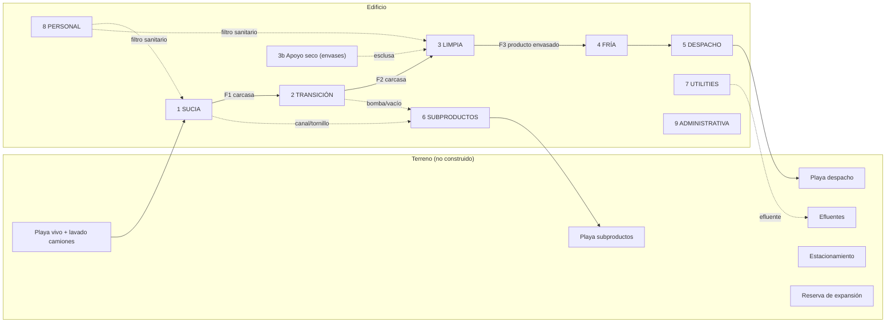

# Zonificación del layout conceptual

**Fecha:** 2026-10-01 · **Versión:** 1.0 (sesión 12C, en paralelo con 12A localización y 12B logística) · Fase 0

> **Alcance:** traduce la zonificación **higiénica** de 09A ([`../05_proceso_industrial/zonificacion_higienica.md`](../05_proceso_industrial/zonificacion_higienica.md), zonas Z0–Z8, ZX, ZS, ZP) a **nueve zonas de layout** que agrupan áreas físicas, y define qué se separa de qué, con qué barrera y en qué orden se ubican. **No** es un plano, **no** fija metros ni posiciones, **no** elige forma de edificio ni terreno.
> **Advertencia terminológica (SUP-122):** los nombres ZONA SUCIA, DE TRANSICIÓN, LIMPIA, FRÍA, DE DESPACHO, DE SUBPRODUCTOS, DE UTILITIES, DE PERSONAL y ADMINISTRATIVA son **categorías de trabajo de este estudio**, no categorías regulatorias. El Decreto 4238/68 y la Res. SENASA 592/2026 **no fueron leídos en su texto original** (DPV-090); las denominaciones y exigencias reglamentarias pueden ser otras. Lo que sí está respaldado (en extracto, `[PVDP]`) es el principio: separación física de la zona sucia (recepción → desplumado) y de la limpia (evisceración → empaque), marcha hacia adelante y flujos que no se crucen ([`../16_normativa_senasa/requisitos_sanitarios.md` §2](../16_normativa_senasa/requisitos_sanitarios.md)).

Documentos hermanos: [`flujos_layout.md`](flujos_layout.md) (flujos) · [`programa_areas.md`](programa_areas.md) (áreas) · [`layouts_por_escala.md`](layouts_por_escala.md) (superficies) · [`estrategia_expansion.md`](estrategia_expansion.md).

---

## 1. Las nueve zonas

| Zona de layout | Zonas higiénicas de 09A | Áreas que contiene ([`programa_areas.md`](programa_areas.md)) | Nivel sanitario (cualitativo) | Temperatura | Quién circula | Barrera de salida hacia la zona siguiente |
|---|---|---|---|---|---|---|
| **1. SUCIA** | Z0 (parte), Z1, Z2 | Recepción y andén de espera, colgado, aturdido, sangrado, escaldado, desplumado, corte de patas y cabeza, lavado de cajones/módulos, playa de vivo, lavado de camiones | Sucio (polvo, plumas, heces, vapor) | Ambiente / caliente-húmedo | Recepción, colgadores, faena | **Pared con paso solo de la línea** (transferencia E11) |
| **2. DE TRANSICIÓN** | Z3 | Evisceración, inspección oficial post mortem, separación de menudencias y vísceras, lavado de carcasas | Intermedio (riesgo fecal) | Ambiente controlado | Evisceradores, servicio oficial | Entrada al enfriamiento (la carcasa pasa; las personas no) |
| **3. LIMPIA** | Z4, Z5, Z6 | Enfriamiento (inicio de la zona limpia en 09A), clasificación, trozado, deshuese, CMS, garras, menudencias, envasado primario, empaque secundario (sub-zona **limpia seca**) | Limpio | Refrigerada | Personal de sala limpia | Producto envasado → cámaras |
| **3b. Apoyo seco de la limpia** | — (09A §1, principio 6) | Depósito de envases, cartón e insumos secos; esclusa de envase primario | Seco, sin producto expuesto | Ambiente | Depósito | **Esclusa / pasaplatos**: el cartón y los pallets no entran a salas de proceso |
| **4. FRÍA** | Z7 | Túneles de congelado, cámaras refrigeradas y congeladas, antecámaras, pasillo frío | Producto envasado | 0–4 °C / ≤ −18 °C (valores a verificar, DPV-090) | Cámaras | Andén de expedición |
| **5. DE DESPACHO** | Z8 | Andenes refrigerados con sello, preparación de pedidos, playa de maniobra de despacho | Producto envasado | Frío (andén con sello) | Expedición, choferes (sin ingresar a zona limpia) | Camión refrigerado |
| **6. DE SUBPRODUCTOS** | ZX | Sala de sangre, tolvas de plumas y vísceras, cabezas, contenedores, cámara de subproductos perecederos, sala de decomisos, residuos y cartón, playa de retiro; **reserva de rendering** | Sucio | Ambiente; parte refrigerada | Personal exclusivo | **Salida propia de camiones**; nunca cruza salas de producto |
| **7. DE UTILITIES** | ZS | Sala de máquinas de frío, caldera, aire comprimido, sala eléctrica, generador, tratamiento y reserva de agua, mantenimiento, repuestos, químicos, **tratamiento de efluentes** (pretratamiento, ecualización, DAF, biológico, lodos) | Técnico | — | Mantenimiento | Ingreso a zonas de producto solo con cambio de indumentaria y herramientas de zona |
| **8. DE PERSONAL** | ZP | Vestuarios separados sucia/limpia y por sexo, sanitarios, lavandería/ropería, comedor, enfermería, capacitación, estacionamiento | Social | — | Todo el personal | **Filtros sanitarios** (pediluvio, lavamanos, cambio de ropa por color) antes de cada zona |
| **9. ADMINISTRATIVA** | ZP (parte) | Oficinas, oficina del servicio oficial SENASA, laboratorio de autocontrol, porterías y seguridad | Social / técnico | — | Administración, inspección, visitas | Visitas solo por circuito de visitas (sin cruzar zonas) |

**Zonas que no son edificio:** circulación pesada, playas de camiones, estacionamiento, tanques, tratamiento de efluentes y reserva de expansión son **terreno**, no m² construidos. Por eso el modelo separa `m² construidos`, `m² operativos` y `terreno` ([`programa_areas.md` §1](programa_areas.md)).

## 2. Fronteras críticas (orden de importancia)

| # | Frontera | Qué la cruza | Qué **no** la cruza | Por qué es difícil de corregir después |
|---|---|---|---|---|
| F1 | **SUCIA → TRANSICIÓN** (transferencia E11) | Solo la carcasa sin plumas, en la línea | Personas, aire, plumas, agua de escaldado, herramientas | Fija la posición relativa de faena y evisceración; si la evisceración se amplía hacia la faena, se invierte el flujo |
| F2 | **TRANSICIÓN → LIMPIA** (entrada al enfriamiento) | Carcasa eviscerada | Vísceras, decomisos, personal de evisceración | El chiller/túnel de aire es el equipo más largo; su lugar condiciona la sala limpia |
| F3 | **LIMPIA → FRÍA → DESPACHO** | Producto envasado | Cartón sucio de retorno, personal de playa | La cadena de frío y los docks fijan la fachada de expedición |
| F4 | **Producto ↔ SUBPRODUCTOS** | Nada (canales, bombas y tornillos salen hacia la zona 6 por su propio camino) | Contenedores de vísceras, plumas o decomisos atravesando salas de producto | Los canales y bombas van **bajo piso o por fachada**; moverlos implica romper pisos |
| F5 | **Vivo ↔ Producto** (exterior) | Nada | Camión de aves vivas y camión de producto por el mismo acceso o playa | La traza de caminos y portones es lo primero que se construye y lo último que se puede mover |
| F6 | **Personal ↔ zonas** | Personas, solo por filtro sanitario | Personas con ropa de otra zona | Vestuarios separados por zona definen pasillos y accesos de todo el edificio |
| F7 | **Aire y agua** | De limpio a sucio | Aire de escaldado hacia evisceración; desagües de sucia pasando por limpia | La pendiente de pisos y el trazado de desagües se fijan en la obra gruesa |

## 3. Orden espacial conceptual (sin geometría)

Lectura: el producto recorre **una sola dirección** (izquierda → derecha); los subproductos salen **lateralmente** hacia su zona y su playa; el personal llega a cada zona **desde** la zona de personal, nunca atravesando otra zona productiva; la zona de utilities es **adyacente** a las cargas grandes (frío junto a cámaras y túneles; caldera junto a escaldado y limpieza) y el tratamiento de efluentes queda **aguas abajo** (cota más baja) y a sotavento de lo limpio, cosa que depende del terreno (12A).

## 4. Reglas de ubicación que surgen de la zonificación (conceptuales)

1. **Orden lineal fijo:** SUCIA → TRANSICIÓN → LIMPIA → FRÍA → DESPACHO. Puede plegarse (forma de U o L), pero **no** invertirse ni saltear zonas.
2. **Principio de diseño preliminar (no regla arquitectónica universal):** preferir expansiones que prolonguen o dupliquen secuencias funcionales (líneas en paralelo, salas de corte contiguas a la limpia, cámaras contiguas a la fría) sin introducir cruces ni romper la zonificación higiénica ([`estrategia_expansion.md` §3](estrategia_expansion.md), SUP-123).
3. **Tres frentes de acceso distintos:** vivo (zona 1), producto (zona 5), subproductos (zona 6); personal y visitas por un cuarto acceso (zonas 8–9). Con dos porterías como mínimo en el modelo (SUP-116); el número real depende de seguridad y del sitio.
4. **Zona de personal "en bisagra":** con vestuarios de zona sucia y de zona limpia que desembocan cada uno en su zona. El comedor no debe ser un atajo entre zonas.
5. **Servicio oficial con acceso propio** a la línea de inspección, a la sala de decomisos y a su oficina, sin cruzar la zona limpia con ropa de zona sucia (09A §1, principio 8).
6. **Utilities en la periferia, con "pared de servicio":** las troncales de frío, agua, vapor y aire corren por una fachada o galería técnica para poder ampliar sin entrar a las salas.
7. **Exportación y Halal:** no cambian el orden de las zonas, pero pueden exigir más separación (lotes, salas dedicadas, aturdido) y más frío. Se preserva la posibilidad con espacio, no con construcción anticipada (DEC-012, DPV-145).

## 5. Qué no se decide aquí

Forma del edificio (lineal, U, L, peine), número de líneas (DEC-038), método de enfriamiento (DEC-026), aturdido (DEC-041), tren de efluentes (DEC-043), rendering (DEC-027), ubicación y orientación en el terreno (DEC-003, 12A), logística de despacho (12B). La forma del edificio se propone como decisión nueva (DEC-062) para cuando exista escala y terreno.
